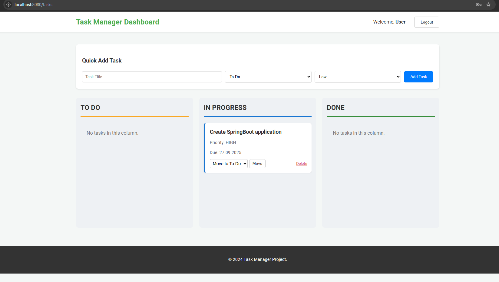

# Task Manager - Kanban Style 🚀

A secure, feature-rich Task Management application featuring a visual **Kanban board**. Built as a robust portfolio piece using modern **Spring Boot 3** standards, this application demonstrates best practices in security, business logic separation, and data persistence.

## ✨ Key Features

* **Kanban View:** Tasks are visually organized into three columns: **TO DO**, **IN PROGRESS**, and **DONE**.
* **Secure Authentication:** Full user registration, login, and logout secured by **Spring Security 6**. Passwords are hashed using BCrypt.
* **User Isolation:** Users can only view, create, and manage their own tasks, ensuring data privacy.
* **Quick Status Update:** Tasks can be moved between columns instantly via a dedicated action endpoint.
* **Data Persistence:** Uses **JPA/Hibernate** to manage user and task data in a relational database.

## 🛠️ Technology Stack

| Category | Technology | Version / Description |
| :--- | :--- | :--- |
| **Backend Framework** | Spring Boot | 3.x (Modern Java Application) |
| **Security** | Spring Security | 6.x (Authentication, Authorization, BCrypt) |
| **Database** | MySQL | External relational database (`taskmanager_directory`) |
| **Data Access** | Spring Data JPA / Hibernate | Object-Relational Mapping (ORM) |
| **Frontend/Templating** | Thymeleaf | Server-Side Rendering (SSR) for dynamic views |
| **Build Tool** | Maven | Project management and build automation |

## ⚙️ Getting Started

Follow these steps to set up the project locally.

### Prerequisites

1.  **Java Development Kit (JDK) 17+**
2.  **MySQL Server** (Running on port 3306 is standard)
3.  **Maven** (Typically bundled with modern IDEs like IntelliJ/Eclipse)

### Step 1: Clone the Repository

```bash
git clone https://github.com/BarneyBoston/springboot_taskmanager.git
```

### Step 2: Configure databases

1. Create the necessary database:
Instructions within the ```src/main/resources/db.migration/task_manager.sql file```

3. Update the connection details in src/main/resources/application.properties:
```bash
spring.datasource.url=jdbc:mysql://localhost:3306/taskmanager_directory
spring.datasource.username=root
spring.datasource.password=YOUR_MYSQL_PASSWORD
```

### Step 3: Run the application:
```bash
./mvnw spring-boot:run
```
The application will start on http://localhost:8080.

## 🔒 Usage Guide

1.  **Access:** Navigate to `http://localhost:8080/` after starting the application.
2.  **Registration:** Click the "Sign Up" button and create a new account. Your password will be securely hashed using BCrypt.
3.  **Login:** Log in using your registered credentials.
4.  **Dashboard (`/tasks`):** You will be automatically redirected to the Task Dashboard, which uses a Kanban view:
    * **Add:** Use the Quick Add form at the top to create a new task. Tasks default to the **TO DO** column.
    * **View:** Tasks are automatically filtered and displayed in three columns: **TO DO**, **IN PROGRESS**, and **DONE**.
    * **Move/Update Status:** On any task card, use the dropdown menu to select a new status (e.g., from TO DO to IN PROGRESS) and click the **Move** button. The task will instantly appear in the correct column.
    * **Delete:** Use the "Delete" link on the task card to permanently remove the task.



